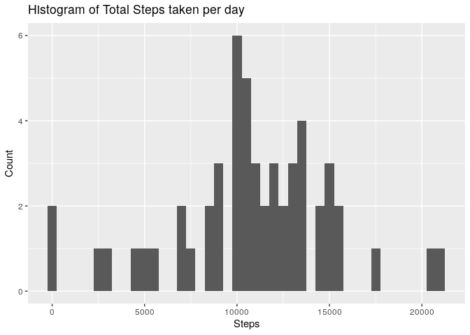
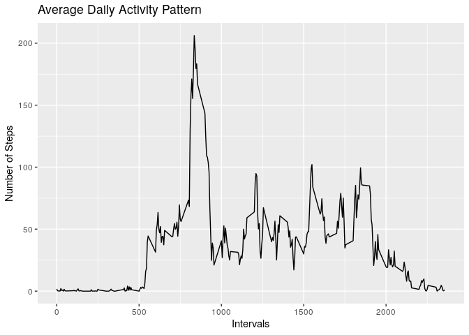
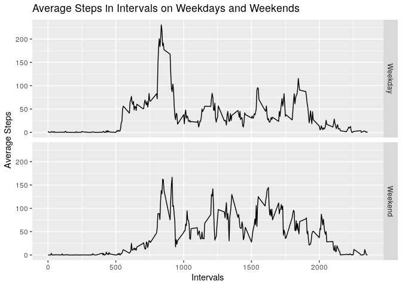

## Required imports

```r
library(ggplot2)
library(dplyr)
```

```
## 
## Attaching package: 'dplyr'
```

```
## The following objects are masked from 'package:stats':
## 
##     filter, lag
```

```
## The following objects are masked from 'package:base':
## 
##     intersect, setdiff, setequal, union
```
## Loading and preprocessing the data  
Reading the csv file after unzipping and converting into Dates

```r
data <- read.csv(unzip("activity.zip"), na.strings = "NA", stringsAsFactors = FALSE)
str(data)
```

```
## 'data.frame':	17568 obs. of  3 variables:
##  $ steps   : int  NA NA NA NA NA NA NA NA NA NA ...
##  $ date    : chr  "2012-10-01" "2012-10-01" "2012-10-01" "2012-10-01" ...
##  $ interval: int  0 5 10 15 20 25 30 35 40 45 ...
```

```r
data$date <- as.Date(data$date, "%Y-%m-%d")
head(data,10)
```

```
##    steps       date interval
## 1     NA 2012-10-01        0
## 2     NA 2012-10-01        5
## 3     NA 2012-10-01       10
## 4     NA 2012-10-01       15
## 5     NA 2012-10-01       20
## 6     NA 2012-10-01       25
## 7     NA 2012-10-01       30
## 8     NA 2012-10-01       35
## 9     NA 2012-10-01       40
## 10    NA 2012-10-01       45
```
## What is mean total number of steps taken per day?
### Total number of steps taken per day

```r
total_steps <- aggregate(steps~date, data, sum)
head(total_steps,10)
```

```
##          date steps
## 1  2012-10-02   126
## 2  2012-10-03 11352
## 3  2012-10-04 12116
## 4  2012-10-05 13294
## 5  2012-10-06 15420
## 6  2012-10-07 11015
## 7  2012-10-09 12811
## 8  2012-10-10  9900
## 9  2012-10-11 10304
## 10 2012-10-12 17382
```
### Histogram of total steps taken per day

```r
ggplot(total_steps, aes(steps)) + geom_histogram(binwidth = 500) + labs(title="Histogram of Total Steps taken per day",x="Steps", y="Count")
```

<!-- -->

### Mean of Total steps

```r
mean(total_steps$steps, na.rm = TRUE)
```

```
## [1] 10766.19
```
### Median of Total steps

```r
median(total_steps$steps, na.rm = TRUE)
```

```
## [1] 10765
```
## What is the average daily activity pattern?
### Average of steps in intervals

```r
avg_steps_interval <- aggregate(steps~interval, data,mean)
ggplot(avg_steps_interval,aes(x=interval, y=steps))+geom_line() + labs(title="Average Daily Activity Pattern", x="Intervals", y="Number of Steps")
```

<!-- -->

## Imputing missing values
### Summary of current dataset

```r
summary(data)
```

```
##      steps             date               interval     
##  Min.   :  0.00   Min.   :2012-10-01   Min.   :   0.0  
##  1st Qu.:  0.00   1st Qu.:2012-10-16   1st Qu.: 588.8  
##  Median :  0.00   Median :2012-10-31   Median :1177.5  
##  Mean   : 37.38   Mean   :2012-10-31   Mean   :1177.5  
##  3rd Qu.: 12.00   3rd Qu.:2012-11-15   3rd Qu.:1766.2  
##  Max.   :806.00   Max.   :2012-11-30   Max.   :2355.0  
##  NA's   :2304
```
From the summary it can be seen that 'steps' column has missing values
Replacing them with average of that particular interval in new dataset

```r
new_data <- data
head(new_data)
```

```
##   steps       date interval
## 1    NA 2012-10-01        0
## 2    NA 2012-10-01        5
## 3    NA 2012-10-01       10
## 4    NA 2012-10-01       15
## 5    NA 2012-10-01       20
## 6    NA 2012-10-01       25
```
Getting indices of rows which have NA values

```r
na_index <- which(is.na(data$steps))
```
Replacing with average of that particular interval

```r
for (i in na_index){
        new_data[i,1] <- avg_steps_interval[which(avg_steps_interval$interval == new_data[i,3]),2]
}
## Checking if all NA values are replaced
summary(data)
```

```
##      steps             date               interval     
##  Min.   :  0.00   Min.   :2012-10-01   Min.   :   0.0  
##  1st Qu.:  0.00   1st Qu.:2012-10-16   1st Qu.: 588.8  
##  Median :  0.00   Median :2012-10-31   Median :1177.5  
##  Mean   : 37.38   Mean   :2012-10-31   Mean   :1177.5  
##  3rd Qu.: 12.00   3rd Qu.:2012-11-15   3rd Qu.:1766.2  
##  Max.   :806.00   Max.   :2012-11-30   Max.   :2355.0  
##  NA's   :2304
```

```r
summary(new_data)
```

```
##      steps             date               interval     
##  Min.   :  0.00   Min.   :2012-10-01   Min.   :   0.0  
##  1st Qu.:  0.00   1st Qu.:2012-10-16   1st Qu.: 588.8  
##  Median :  0.00   Median :2012-10-31   Median :1177.5  
##  Mean   : 37.38   Mean   :2012-10-31   Mean   :1177.5  
##  3rd Qu.: 27.00   3rd Qu.:2012-11-15   3rd Qu.:1766.2  
##  Max.   :806.00   Max.   :2012-11-30   Max.   :2355.0
```
### Differences between mean and median of both the datasets

```r
new_total_steps = aggregate(steps~date, new_data, sum)
mean(new_total_steps$steps)
```

```
## [1] 10766.19
```

```r
median(new_total_steps$steps)
```

```
## [1] 10766.19
```

## Are there differences in activity patterns between weekdays and weekends?  
### Creating new factor variables with 2 levels "Weekday" and "Weekend"

```r
new_data <- new_data %>% mutate(weekday = weekdays(data[,2]))
head(new_data)
```

```
##       steps       date interval weekday
## 1 1.7169811 2012-10-01        0  Monday
## 2 0.3396226 2012-10-01        5  Monday
## 3 0.1320755 2012-10-01       10  Monday
## 4 0.1509434 2012-10-01       15  Monday
## 5 0.0754717 2012-10-01       20  Monday
## 6 2.0943396 2012-10-01       25  Monday
```

```r
tail(new_data)
```

```
##           steps       date interval weekday
## 17563 2.6037736 2012-11-30     2330  Friday
## 17564 4.6981132 2012-11-30     2335  Friday
## 17565 3.3018868 2012-11-30     2340  Friday
## 17566 0.6415094 2012-11-30     2345  Friday
## 17567 0.2264151 2012-11-30     2350  Friday
## 17568 1.0754717 2012-11-30     2355  Friday
```
Giving levels based on weekday

```r
new_data <- new_data %>% mutate(day_type = ifelse(weekday %in% c("Saturday", "Sunday"),"Weekend","Weekday"))
head(new_data)
```

```
##       steps       date interval weekday day_type
## 1 1.7169811 2012-10-01        0  Monday  Weekday
## 2 0.3396226 2012-10-01        5  Monday  Weekday
## 3 0.1320755 2012-10-01       10  Monday  Weekday
## 4 0.1509434 2012-10-01       15  Monday  Weekday
## 5 0.0754717 2012-10-01       20  Monday  Weekday
## 6 2.0943396 2012-10-01       25  Monday  Weekday
```

```r
tail(new_data)
```

```
##           steps       date interval weekday day_type
## 17563 2.6037736 2012-11-30     2330  Friday  Weekday
## 17564 4.6981132 2012-11-30     2335  Friday  Weekday
## 17565 3.3018868 2012-11-30     2340  Friday  Weekday
## 17566 0.6415094 2012-11-30     2345  Friday  Weekday
## 17567 0.2264151 2012-11-30     2350  Friday  Weekday
## 17568 1.0754717 2012-11-30     2355  Friday  Weekday
```
Aggregating based on intervals and "Weekday" or "Weekend"

```r
avg_steps <- aggregate(steps~interval+day_type, new_data,mean)
head(avg_steps)
```

```
##   interval day_type      steps
## 1        0  Weekday 2.25115304
## 2        5  Weekday 0.44528302
## 3       10  Weekday 0.17316562
## 4       15  Weekday 0.19790356
## 5       20  Weekday 0.09895178
## 6       25  Weekday 1.59035639
```
Plotting

```r
ggplot(avg_steps,aes(x=interval, y=steps)) + geom_line() + facet_grid(day_type ~ .) + labs(title="Average Steps in Intervals on Weekdays and Weekends",x="Intervals",y="Average Steps")
```

<!-- -->
On weekdays average number of steps are higher than average number of steps on weekends
